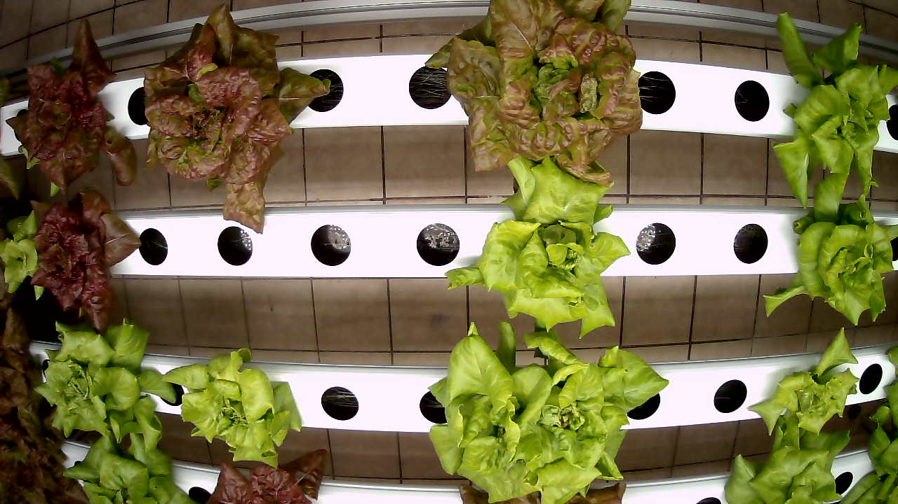
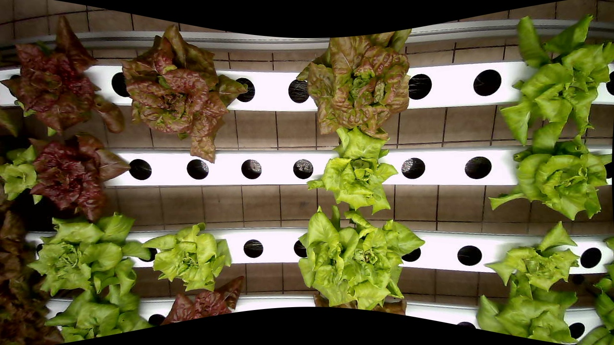
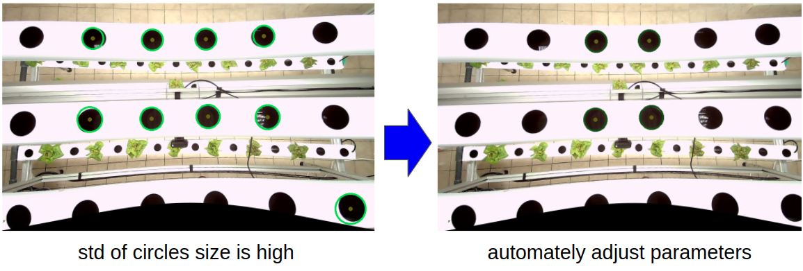
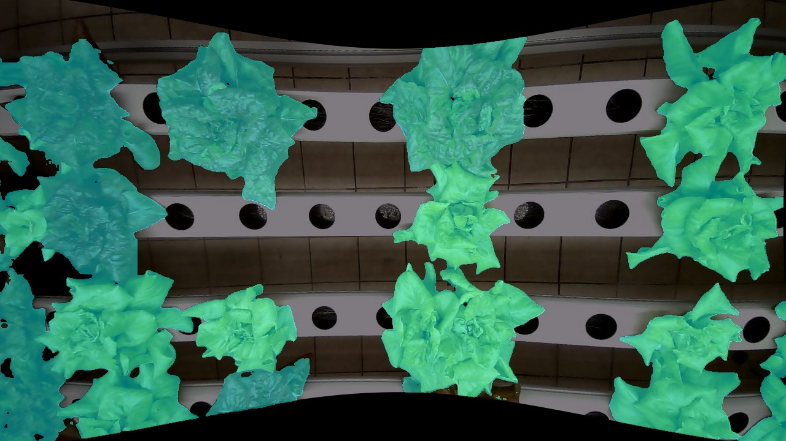
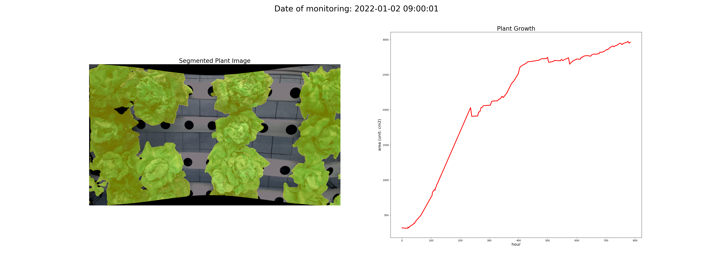
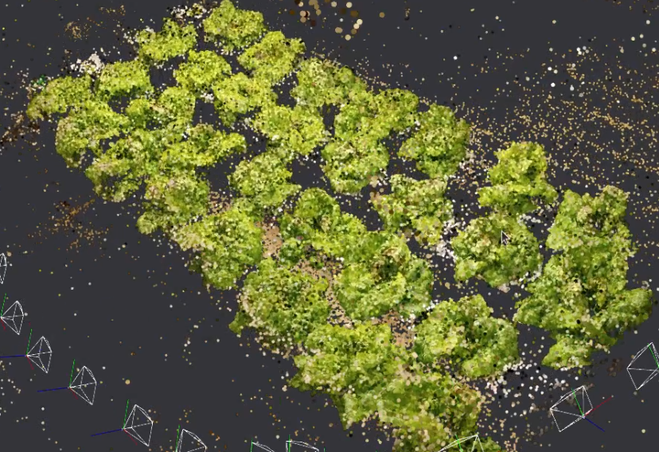

## Use Case
1. Compute camara intrinsic parameters using checker board images (save in meta)
    ```
    hexa = openHexa.imgProcess.hexa_process()
    hexa.calibrate(imgpath_checker=PATHCHECKER, corner_w=CORNER_WIDTH,
                   corner_h=CORNER_HEIGHT, metafile=METAPATH, separator=SEPARATOR)
    ```
    `PATHCHECKER: Directory of checker images, METAPATH: Directory to save meta data, SEPARATOR: delimiter, ACTUAL_DIM: actual diameter of circle`
2. Undistort images using camera intrinsic parameters (only once)
    ```
    hexa = openHexa.imgInstance.hexa_img()
    hexa.load_img(filepath = IMGFILE, metapath=METAPATH, separator = SEPARATOR)
    hexa.undistort()
    ```
    `IMGFILE: image to undistort, METAPATH: Location of meta data, SEPARATOR: delimiter`
3. Compute ratio of pixel to mm  (save in meta)
    ```
    hexa = openHexa.imgProcesshexa_process()
    hexa.compute_px_ratio(filepath=INPUT, metapath=METAPATH, separator=SEPARATOR, actual_dim=ACTUAL_DIM)
    ```
    `INPUT: image file, METAPATH: Directory to save meta data, SEPARATOR: delimiter, ACTUAL_DIM: actual diameter of circle`

4. Estimate the actual area of plants using segmentation mask and pixel to mm
    ```
    hexa.undistort().segment(config_file=CONFIG,checkpoint_file=CHECKPOINT, show = True, pallete_path=".").compute_area()
    ```
    After undistortion, apply [semantic segmentation](https://github.com/hexafarms/mmsegmentation).
    By using the segmentation mask, compute area.

5. Tracking the growth of plants ([video](https://www.youtube.com/watch?v=ZE3k3feZKHE))
    ```
    hexa.document(areas)
    ```
    

6. Reconstruct plant models using camera parameters <br>
    `TBD`

## Demo

1. Image undistortion.
<p float="left">
  
  
</p>
2. Compute ratio of pixel to mm 
<p float="left">
  
</p>
3. Image Segmentation
<p float="left">
  
</p>
4. Plant Growth 
<p float="left">
  
</p>

5. 3D reconstruction
<p float="left">
  
</p>

### Nameing rule of cameras
```
{location}-{camera_code}-{epoch time}.{format}
```
camera_code may (or may not) contain "-" in the file name.
"-" could be replaced by changing "SEPARATOR" value.
